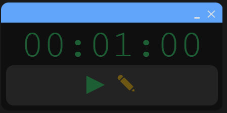
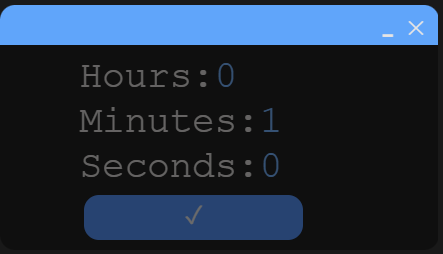
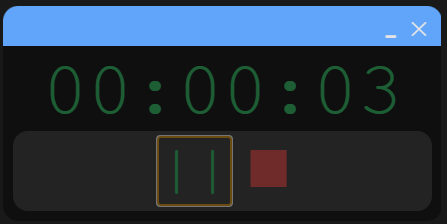
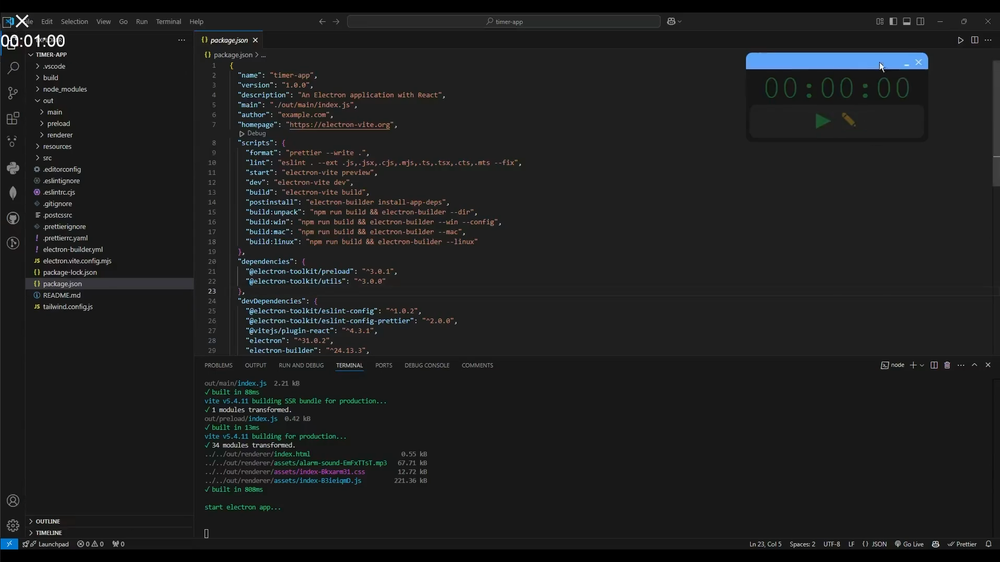

# Timer App

A simple desktop timer application built using **Electron**, **Vite**, **React**, and **Tailwind CSS**. This app allows users to set a timer using hours, minutes, and seconds. When the timer ends, an alert sound is played.

---

## Features

- Set timer using hours, minutes, and seconds.
- Alert sound on timer completion.
- User-friendly interface using **Tailwind CSS**.
- Lightweight and fast, built with **Electron-Vite**.

---

## Getting Started

### Prerequisites

- [Node.js](https://nodejs.org/)
- [npm](https://www.npmjs.com/) or [yarn](https://yarnpkg.com/)

### Installation

1. Clone the repository:
    ```sh
    git clone https://github.com/your-username/desktop-mini-timer-app.git
    ```
2. Navigate to the project directory:
    ```sh
    cd desktop-mini-timer-app
    ```
3. Install dependencies:
    ```sh
    npm install
    ```


### References

- [YouTube Tutorial](https://youtu.be/6sMM5tGZUaQ?si=-U0TzgNmSxThxabL)
- [Electron-Vite Documentation](https://electron-vite.org/guide/)
- [ElectronJS Documentation](https://www.electronjs.org/docs/latest)

### Screenshots

### Screenshots

Here are some screenshots of the app:

  
**Main Screen:** The main screen features two buttons: "Start" and "Set Timer".

  
**Set Timer Screen:** This screen allows you to set the timer using hours, minutes, and seconds.

  
**Timer Running Screen:** The timer running screen shows the countdown timer with options to pause and stop.


### Demonstration

Here's a short demonstration of the app:

[](https://youtu.be/kie6t0B9MeE)


### Contributing

If you would like to contribute, please fork the repository and use a feature branch. Pull requests are warmly welcome.
